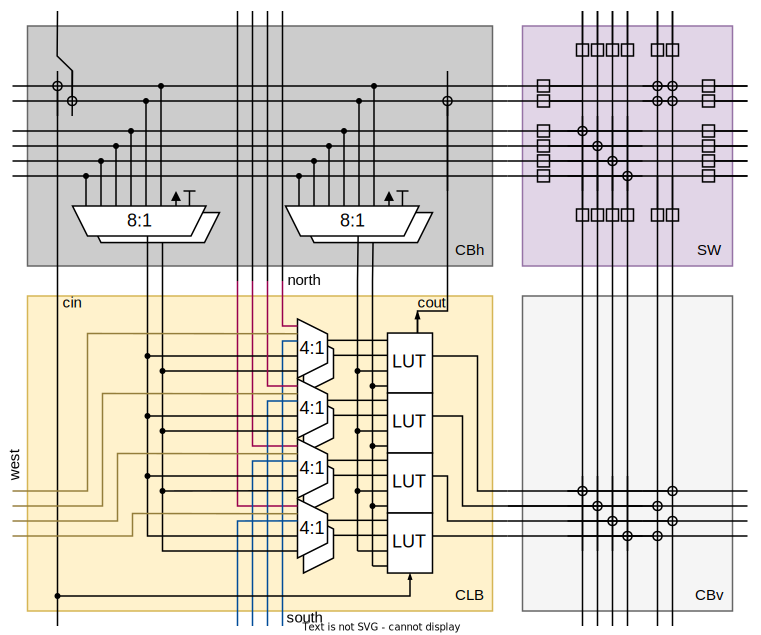

# Discrete 7400 logic based FPGA
A custom, modular FPGA architecture simulated in VHDL (GHDL), realized with discrete 7400-logic ICs and layouted on PCB with KiCAD.

---

Read more on my blog: [mnemocron.github.io](https://mnemocron.github.io/2023-12-08-DIY-FPGA-diary-1/)

## Motivation

> Why build arguably the worst FPGA ever?

Ever since building Ben Eaters [8 bit CPU](https://eater.net/8bit) myself, I wanted to build something even crazier.
The 8 bit CPU is arguably the worst CPU ever built - but it is a fantastic educational example.
And that is the case for the **4 bit FPGA**. It is a purely educational side project that boosted my knowledge about FPGA architecture, VHDL design and verification. Without further ado, here it is.

## Build Process

## Inspiration & Honorable Mentions

### Build an 8-bit computer from scratch

> I built a programmable 8-bit computer from scratch on breadboards using only simple logic gates. I documented the whole project in a series of YouTube videos and on this web site. Watch this video for an introduction:

on [eater.net](https://eater.net/8bit)

### Build your own FPGA

> Building a microcontroller or CPU out of discrete logic is a popular hobbyist pursuit, and it serves a useful purpose: building a CPU from scratch teaches you a lot about CPU architecture and tradeoffs; it's an interesting and instructive exercise. So, I wondered, wouldn't building an FPGA out of discrete logic be similarly educational? 

on [Nick's Blog](http://blog.notdot.net/2012/10/Build-your-own-FPGA)

on [Hackaday](https://hackaday.com/2012/11/01/discrete-fpga-will-probably-win-the-7400-logic-competition/)

### Princeton Regonfigurable Gate Array

> Build your own FPGA Chip or embedded FPGA IP with Python, and enjoy a fully open-source, auto-generated CAD flow specifically for your custom FPGA.

on [github](https://github.com/PrincetonUniversity/prga)

on [princeton.edu](http://parallel.princeton.edu/prga/)

