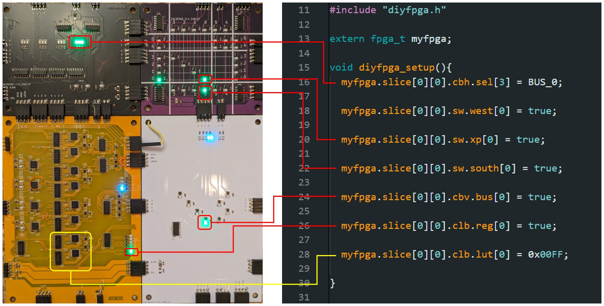
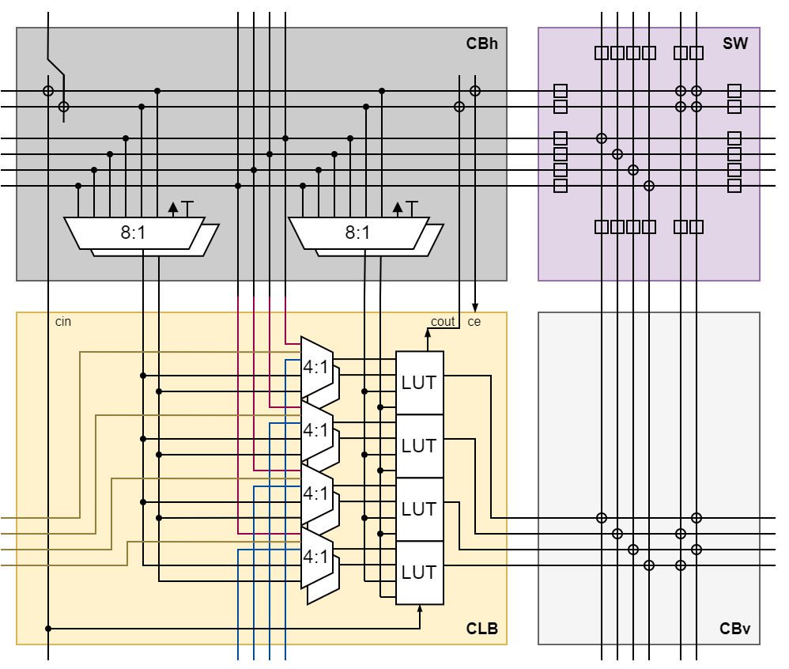
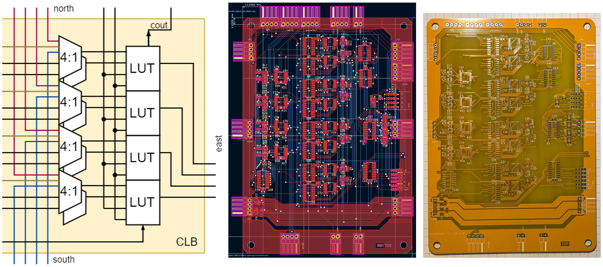
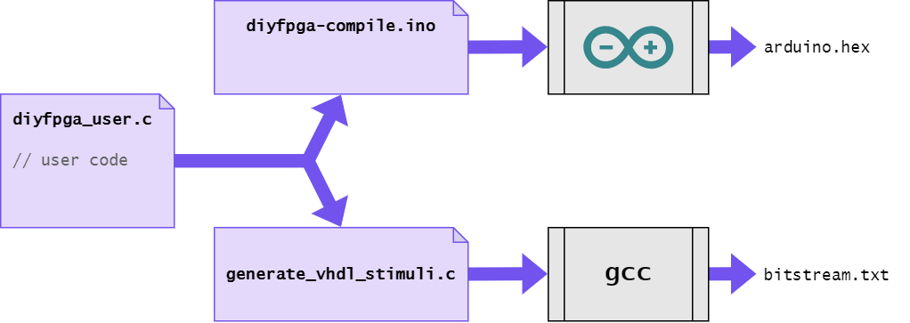

# Discrete 7400 logic based FPGA
A custom, modular FPGA architecture simulated in VHDL (GHDL), realized with discrete 7400-logic ICs, layouted on PCB with KiCAD and programmed through an abstraction layer via Arduino.

---

Read the full thorugh process and many explanations on my blog: 
[mnemocron.github.io](https://mnemocron.github.io/2023-12-08-DIY-FPGA-diary-0/)

## Motivation

> Why build arguably the worst FPGA ever?

Ever since building Ben Eaters [8 bit CPU](https://eater.net/8bit) myself, I wanted to build something even crazier.
The 8 bit CPU is arguably the worst CPU ever built - but it is a fantastic educational example.
And that is the case for the **4 bit FPGA**. It is a purely educational side project that boosted my knowledge about FPGA architecture, VHDL design and verification. Without further ado, here it is.

## Build Process

The actual part list is WIP. Expected material cost are approximately 50 USD per assembled tile (4:4 bit LUT with interconnect).

---

## Start Here!

Do you want to build this FPGA yourself? Great! Everything, I made regarding this project is in this repository.

To understand the architecture start with `./architecture` or read about it on my blog.
Next, you may dive into the VHDL simulations in `./vhdl` and try out a few things.
Head straight to the `./vhdl/test` directory to see examples with the full FPGA architecture (instead of sub units).

- `./architecture` contains conceptual draw.io block diagrams
- `./doc` contains images, notes and tools that may be helpful
- `./ihdl` (WIP) contains ideas and concepts for a "compiler"
- `./kicad` contains **schematics and PCB files** for KiCAD 7.0
- `./sketch` contains Arduino code for testing of assembled PCB hardware and **abstraction layer in C**
- `./vhdl` contains models for 74xx ICs and the **full FPGA architecture for simulation**

---

## "Assemble" code to map onto the FPGA in Arduino

---

## Inspiration & Honorable Mentions

### Build an 8-bit computer from scratch

> I built a programmable 8-bit computer from scratch on breadboards using only simple logic gates. I documented the whole project in a series of YouTube videos and on this web site. Watch this video for an introduction:

on [eater.net](https://eater.net/8bit)

### Build your own FPGA

> Building a microcontroller or CPU out of discrete logic is a popular hobbyist pursuit, and it serves a useful purpose: building a CPU from scratch teaches you a lot about CPU architecture and tradeoffs; it's an interesting and instructive exercise. So, I wondered, wouldn't building an FPGA out of discrete logic be similarly educational? 

on [Nick's Blog](http://blog.notdot.net/2012/10/Build-your-own-FPGA)

on [Hackaday](https://hackaday.com/2012/11/01/discrete-fpga-will-probably-win-the-7400-logic-competition/)

### Princeton Regonfigurable Gate Array

> Build your own FPGA Chip or embedded FPGA IP with Python, and enjoy a fully open-source, auto-generated CAD flow specifically for your custom FPGA.

on [github](https://github.com/PrincetonUniversity/prga)

on [princeton.edu](http://parallel.princeton.edu/prga/)

