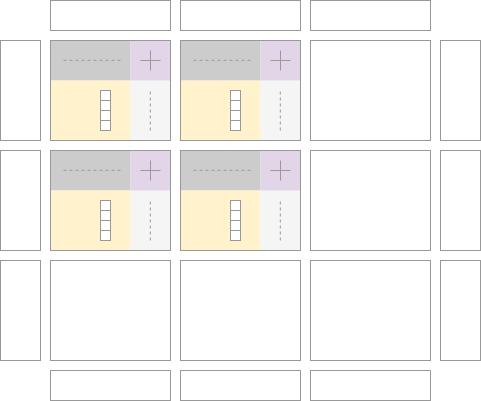
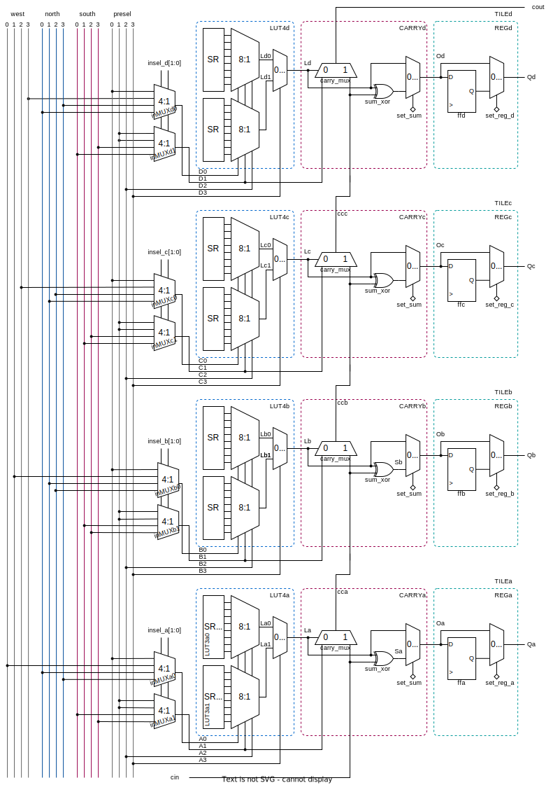

# Architecture Documentation

---

The custom FPGA consists of a 2D array of architecture tiles.
An architecture `TILE` signifies the smallest modular building block.

A tile contains four sub blocks:

- `CLB` Configurable Logic Block
- `CBh` horizontal Connection Box
- `CBv` vertical Connection Box
- `SW` Switch Box

## Configurable Logic Block `CLB` 

The CLB is a 4 bit reconfigurable logic block which offers several 4 bit wide input buses and a common 4 bit wide output bus.
Each of the four output bits is driven by a 4 input look-up table (LUT), the `LUT4` primitive.
The instantiation of three bit input `LUT3`s with two bit outputs is not possible.

The `CLB` various operation modes to support different use cases.
To split the operation mode between the individual output bits is possible with the exception of the sum mode.

The operation modes are:

- regular LUT mode (with `presel` as input)
- LUT expansion mode (with `west` as input)
- sum mode (with both `north` and `south` as inputs)

### CLB Input Multiplexer (post select)

Each of the four `LUT4` an input selection multiplexer stage on input bits `[1:0]`.
This input post selection stage is used to configure different operation modes for the entire `CLB`.
The configuration signal for the input multiplexers is `insel_*[1:0]` (where `*` is `a`,`b`,`c`,`d`).

If the input multiplexer is left unconfigured (`insel_*[1:0] = 00b` in bitstream) the regular mode with `presel[1:0]` is selected.

In the LUT expansion mode `insel_*[1:0] = 01b` uses the `west` input bus as an input. This way a 4 bit function from the westward `CLB` can be expanded by another 3 bits from the remaining `presel[3:1]` inputs.

The sum mode (`insel_*[1:0] = 1Xb`) configues the input multiplexers to use one bit from each the `north` and the `south` bus to be added together. Two bit direction modes are supported to reverse the bit order of the 4 input bits.
Note that in sum mode, all four `LUT4` work in unison to add two 4 bit numbers. 
A single `LUT4` cannot be decoupled for another operation.

### CLB Input Buses

There exist four different input bus options for various use cases:

- **Preselect** (any combination and order of interconnect signals from the north `CBh` block)
- **West** (directly source the output of the westward `TILE` used to expand number of inputs >4)
- **North** (entire interconnect bus from the north `CBh` used in sum mode as one 4 bit input)
- **South** (entire interconnect bus from the south `CBh` used in sum mode as one 4 bit input)

#### `presel[3:0]`

The signals into the `presel[3:0]` are assigned by the north `CBh` block.
The upper two bits [3:2] are shared between all four `LUT4` primitives within the `CLB`.
When all four `LUT4` are configured to use `presel[3:0]` inputs, a 4:4 bit LUT function can be programmed.

### `north[3:0]`

### `south[3:0]`

### `west[3:0]`

### `CLB` Detailed Functional Diagram

---

