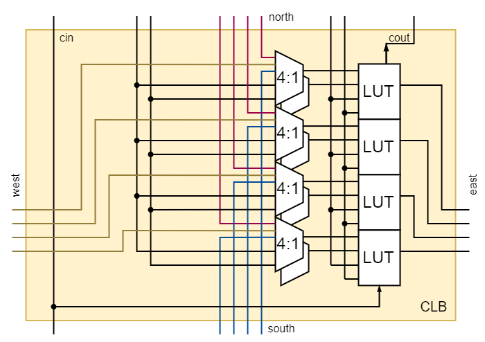
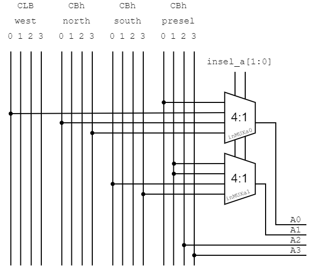
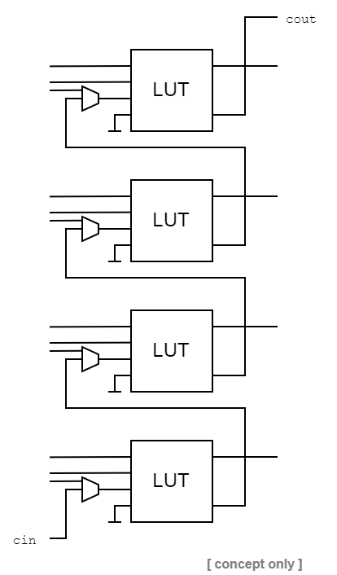

# Configurable Logic Block (CLB)

---

A look up table has to have at least 2 inputs and one output.
To create more useful functions, more inputs are added.
One could create a LUT with 16 inputs to cover logic operations that depend on up to 16 input variables.
Such functions are rare and many of the inputs (and subsequently area on the silicon) would be wasted.
There is a balance regarding the maximum number of inputs which is somewhere between 4 and 6 inputs.
Various FPGA vendors have different approaches to it.

## Number of Inputs / Outputs

The number of outputs is usually 1. Some vendors however allow a 6:1 LUT to be configured as a 5:2 LUT instead, offering 2 outputs taking the same 5 signals as inputs.
This FPGA does not have a configurable number of outputs.
It would increase the complexity of the output routing and interconnect.

## CLB Architecture

### Look Up Table (LUT) 

#### LUT3 / LUT4

To create useful applications within a reasonable usage of hardware area a 4 input LUT is proposed.
LUTs are most effectively implemented using a multiplexer which uses the LUT input signals as the address signals.
Since `2^4` input multiplexers are less common than `2^3` input multiplexers, the LUT4 is composed of two LUT3 primitives.
Here, a feature that configures the LUT4 (4:1) into a 2 output LUT3 (3:2) could be implemented. 
However, since there are 4 LUT4 instances in one CLB and because the output bus architecture only has 4 signals it makes no sense to have 8 outputs per CLB.

#### LUT Bundle (Slice / Block)

Multiple LUTs are usually bundeled within a block that is then called a configurable logic block (CLB).
(Sometimes LUTs are bundeled in slices and slices are bundeled in a block)
The CLB adds additional features and configurable options between the LUTs inside that block.
The most common feature is the carry chain.
One feature that is added to this FPGA is the carry chain.

### Connection Ports

The CLB requires input ports and output ports. 
A helpful simplification in the overall FPGA architecture is to define a direction in which the signals travel.
In this FPGA it is from west to east and in a weaker sense from north to south.

The CLB has four bus input ports:
- 4 bit bus north
	+ this is one of the 4 bit inputs for the adder mode
- 4 bit bus south
	+ this is one of the 4 bit inputs for the adder mode
- 4 bit bus west
	+ this bus is the direct output of the west CLB
- 4 bit preselected input
	+ each bit is preselected to any one signal of the bus
	+ allows for bit position changes (shift / rotate / flip)

The CLB has one 4 bit output port.

The CLB has 2 carry in signals and one carry out signal.
- North `cin` 
	+ can be activated in the north connection box
- South `cin` 
	+ can be activated in the north connection box of the south CLB

### Input Multiplexers 4:1 (post select) `insel*`

Under normal circumstances, all 4 LUTs inside the CLB receive the same 4 (preselected) input signals.
Depending on the individual LUT configuration, 4 different output signals are possible.
When performing the addition operation, this configuration of inputs is insufficient since it only allows for 2 + 2 bit additions.
Therefore, each LUT has 2 4:1 multiplexers before their `A2` and `A3` inputs.

The 4-way input multiplexers have 4 modes.

| `insel_*[1:0]` | mode |
|:-------|:------|
| `00` | regular preselect input `INMODE_PRESEL` |
| `01` | expanded LUT input `INMODE_EXPIN` |
| `10` | sum mode `INMODE_SUM` |
| `11` | sum mode bit reversed `INMODE_SUM_REVERSE` |

### Carry Look Ahead Adder

Performing additions in hardware requires a number of one bit full-adder circuits equal to the bit length of the largest number to be added.
A regular full adder can add 1 + 1 bits + 1 carry bit.
The carry bit is propagated from the LSB to the MSB.
A calculation is complete when the MSB of the sum is calculated which can only happen after the previous bits have ben sequentially calculated.

One way this could have been implemented is shown in the following picture.
It has been implemented this way in the other discrete FPGA on [Nick's Blog](http://blog.notdot.net/2012/10/Build-your-own-FPGA).
The LUT would be configured in a dual 3:2 LUT (instead of the regular 4:1) where one output is the sum output and the other output is the propagated carry.
This solution complicates the input multiplexin would add another 2:1 multiplexer to the proposed architecture draft.

There is one substantial drawback when using long carry chains. 
The carry chain is the (timing) critical path.
For FPGAs there exist improvements to this problem to improve (timing) performance.
Xilinx FPGAs solve the critical path problem using a __Carry Look Ahead Adder__ as shown in the next picture. 
The carry bit is calculated in advance and selected based on the result of the current sum bit.

An example calculation of `13 + 5 = 18` is shown in the following figure.

### Final LUT4 Architecture

The implemented LUT4 architecture is shown below. It features:
- LUT4 composed of 2x LUT3 instances
- __look ahead carry__ (optional sum mode)
- 4:1 input options for 2 of the 4 inputs
- optional output register (D-type flip flop)

---

## 74** Part List

- `74**151`/ (`74**251` with tri-state output)
	+ single 8-input multiplexer
- `74**595`
	+ 8 bit shift register with latch
	+ used as one LUT3 memory
	+ used as configuration memory
- `74**153` / (`74**253` with tri-state output)
	+ dual 4-input multiplexer
	+ used as input selector
- `74**86`
	+ quad 2-input XOR
	+ used for sum calculation
- `74**157` / (`74**257` with tri-state output)
	+ quad 2-input multiplexer
	+ used for the LUT4 output selection (LUT output vs. sum output)
- `74**175`
	+ quad D-type flip flop
- `74**1GG157`
	+ single 2-input multiplexer
	+ used to combine 2x LUT3 instances to LUT4
	+ used for carry chain
