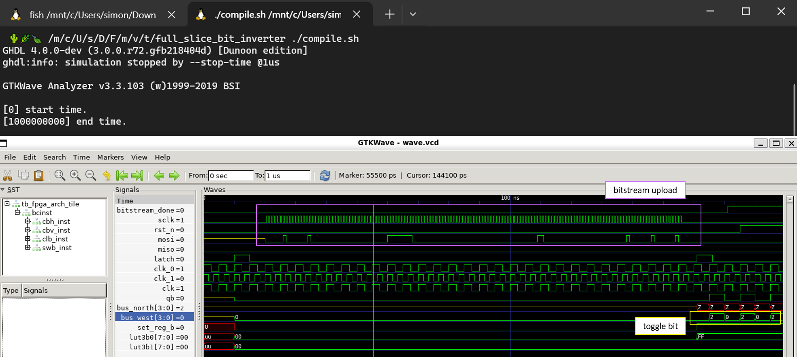

# VHDL Simulation
---

## Run Simulation

The VHDL simulation consists of separate modules/units/entities for each 74xx chip.
Using the 74xx models, the higher level CLB, CBh, CBv and SW entities can be constructed.
Those four (CLB, CBh, CBv, SW) form the top level entity: a tile (`arch_tile`) which is one modular building block of the FPGA.
Multiple tiles in a 2D matrix form the full FPGA - this is not yet implemented in simulation.

Each entity folder contains a `compile.sh` which runs the unit testbench and opens GTKWave to inspect the waveform.
The testbenches are not self-checking although some of them contain assert statements.

This codebase was tested with the following setup:
- GHDL 4.0.0-dev (3.0.0.r72.gfb218404d)
- GTKWave Analyzer v3.3.103
- on Windows 10 WSL2 (Ubuntu 20.04.6 LTS focal on Windows 10 x86_64)

---

## FPGA modules

### Arch Slice (top level)

- Entity: `arch_slice`
- Dependencies: 
	+ `clb_slice`
	+ `sw_box`
	+ `connection_box_horizontal`
	+ `connection_box_vertical`
- Version: ``
- Tests: 
- Comments: see the `/tests` directory for various bitstreams that are uploaded to the `arch_slice` testbench

### CLB

- Entity: `clb_slice`
- Dependencies: 
	+ `sr_74xx595`
	+ `ff_74xx175`
	+ `mux_74xx151`
	+ `mux_74xx153`
	+ `mux_74xx157`
	+ `mux_74LVC1G157`
	+ `xor_74xx86`
- Version: `1.0.0`
- Tests: ✅
- Comments: simple tests only

### CBv

- Entity: `connection_box_vertical`
- Dependencies: 
	+ `sr_74xx595`
	+ `cbox`
- Version: `1.0.0`
- Tests: ✅
- Comments: only checking for multiple drivers inside entity itself

### CBh

- Entity: `connection_box_horizontal`
- Dependencies: 
	+ `sr_74xx595`
	+ `cbox`
	+ `mux_74xx151`
- Version: `1.0.0`
- Tests: -
- Comments: no self checking testbench

### SW box

- Entity: `sw_box`
- Dependencies: 
	+ `sr_74xx595`
	+ `digital_switch`
	+ `newsw`
- Version: ``
- Tests: -
- Comments: 

---

### MUX 8:1 74xx151 / 74xx251
- Single 8-Input Multiplexer
- for LUT3 elements

### MUX 4:1 74xx153 / 74xx253
- Dual 4-Input Multiplexer
- CLB tile input[3:2] select

### MUX 2:1 74xx157 / 74xx257
- Quad 2-Input Multiplexer
- sum output selector (`set_sum`)

### MUX 2:1 74-1G157
- Single 2-Input Multiplexer
- LUT4 element, set_reg, carry_mux

### D-type Register 74xx175
- Quad D-type Flip Flop

### XOR 74xx86
- Quad 2-Input XOR
- sum

### Shift Register 74xx595
- 8-bit shift register with latch
- LUT3 memory, configuration registers

---

| IC | simulation |
|:---|:-----------|
| 74xx157 | ✅ |
| 74xx153 | ✅ |
| 74xx151 | ✅ |
| 74xx175 | ✅ |
| 74xx595 | ✅ |
| 74xx86  | ✅ |
| 74_1G157 | ✅ |

---

## Interconnect Simulation

- use `std_logic` not `std_ulogic` because of "multiple drivers"

